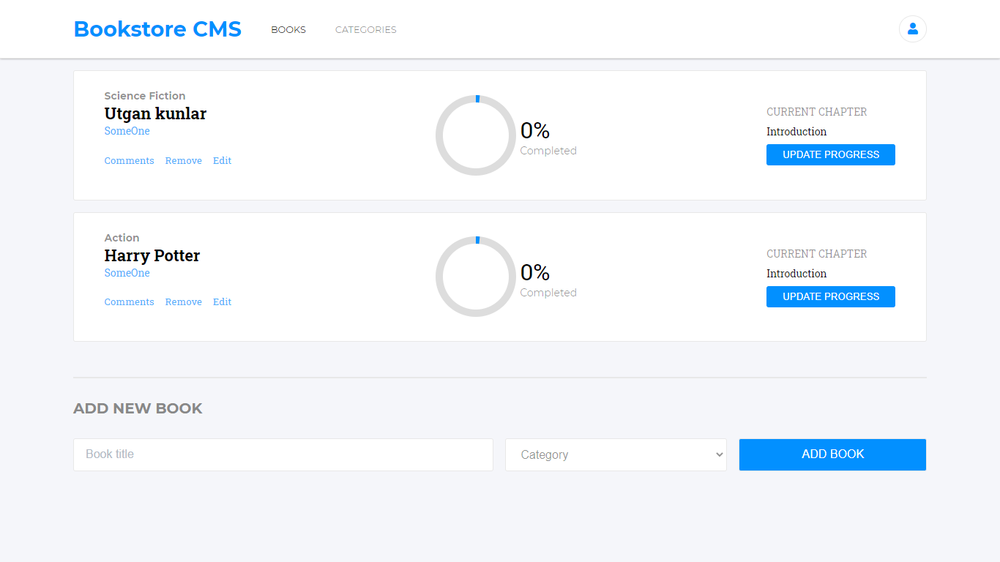

# Bookstore

> The Bookstore is a website that allows you to:
- Display a list of books. 
- Add a book.
- Remove a selected book.

# Screenshot

# Built With

- React
- Redux

# Getting started

## To get a local copy of this repository kindly follow the steps below.
- In your local PC, open your terminal or command prompt in the folder you would like to clone this repository into
- Make sure you have `Node NPM` installed on your computer
- Clone or download this repo on your machine: `git clone https://github.com/bookstore.git`
- Enter project directory with command `cd bookstore`
### Install
- Run `npm install`
### Testing
- Run `npm test`
### Usage
- Run `npm start`

# Author
:bust_in_silhouette: Tolibjon Tolibov
- GitHub: [@toliboff](https://https://github.com/toliboff)
- Twitter: [@tolib_tolibov](https://twitter.com/tolib_tolibov)
- LinkedIn: [Tolibjon](https://linkedin.com/in/tolibjon-tolibov)

# Contributing
Contributions, issues, and feature requests are welcome!

Feel free to check the [issues page.](https://github.com/toliboff/bookstore/issues)

# Show your support
Give a :star: if you like this project!

* [Original design and idea](https://web.archive.org/web/20180320194056/http://www.getminimalist.com:80/)
* [Webpack](https://webpack.js.org/)
* [Jest](https://jestjs.io/)
* [GitHub](https://www.github.com)
* [Microverse](https://microverse.org)

